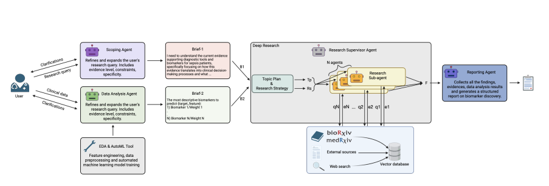

# Tri-Agent Workflow

## Introduction

This project aims to implement the Tri-Agent workflow introduced in the following [paper](https://arxiv.org/pdf/2510.16080).
The Tri-Agent workflow aims to improve on the current triage system in many emergency departments around the world. 

We aim to use CrewAI to reconstruct this from the research paper - a framework for building Agentic AI systems. 
It consists of an agent for each stage of the pipeline

1. Scoping Agent
2. Data Analysis Agent
3. Research Supervisor Agent
4. Reporting Agent




## Installation

Install the [uv](https://docs.astral.sh/uv/#highlights) package manager. Then:

```bash
uv sync
```

For development,
```bash
uv sync --all-extras
```
