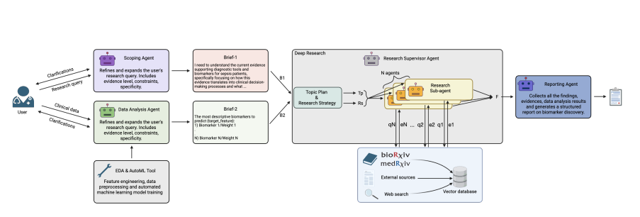

# Tri-Agent Workflow

## Introduction

This project aims to implement the Tri-Agent workflow introduced in the following [paper](https://arxiv.org/pdf/2510.16080).
The Tri-Agent workflow aims to improve on the current triage system in many emergency departments around the world. 

While TriAgent uses LangGraph and LangChain, we aim to use a newer tool called CrewAI.

Instead of completely re-implementing this pipeline (which is more aimed at identifying new biomarkers that aren't currently used), this pipeline aims to be a deployable model that recommends the biomarkers that should be taken from a patient, given their history and their current readings.




## Installation

Install the [uv](https://docs.astral.sh/uv/#highlights) package manager. Then:

```bash
uv sync
```

For development,
```bash
uv sync --all-extras
```

# Development

Development notes, brainstorming and ideation found in the dev/ folder
